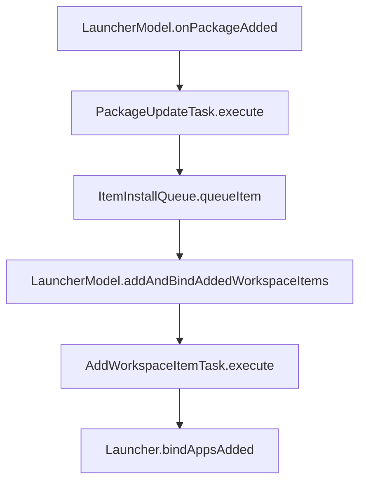

基于 Launcher3 2c34cba

### 概述
找到LauncherModel中监听应用安装的回调，在PackageUpdateTask中通过ItemInstallQueue发送一条添加应用图标的任务，桌面在onResume后会执行图标添加

### 代码修改位置
找到com.android.launcher3.model.PackageUpdatedTask这个类，在execute方法中最后面部分进行修改
修改前
```kotlin
if (mOp == OP_ADD) {
    // Load widgets for the new package. Changes due to app updates are handled through
    // AppWidgetHost events, this is just to initialize the long-press options.
    for (int i = 0; i < N; i++) {
        dataModel.widgetsModel.update(app, new PackageUserKey(packages[i], mUser));
    }
    bindUpdatedWidgets(dataModel);
}
```
修改后
```kotlin
if (mOp == OP_ADD) {
    for (String pkg : mPackages) {
        //将新安装的应用包名和当前user发送给ItemInstallQueue待添加
        ItemInstallQueue.INSTANCE.get(context).queueItem(pkg，mUser);
    }
    
    // Load widgets for the new package. Changes due to app updates are handled through
    // AppWidgetHost events, this is just to initialize the long-press options.
    for (int i = 0; i < N; i++) {
        dataModel.widgetsModel.update(app, new PackageUserKey(packages[i], mUser));
    }
    bindUpdatedWidgets(dataModel);
}
```
### 简易流程


### 逻辑分析
在LauncherAppState的构造方法中，LauncherModel被注册到了LauncherApps中，LauncherApps是一个系统服务，可以用来查询和监听系统内应用的安装卸载等变化。
LauncherModel类继承了LauncherApps.Callback并实现了其回调方法。
所以当有新应用安装成功后，会回调此方法，在此方法内创建了一个op为OP_ADD的PackageUpdatedTask给线程池执行
```kotlin
@Override
public void onPackageAdded(@NonNull final String packageName, @NonNullfinal UserHandle user) {
    int op = PackageUpdatedTask.OP_ADD;
    enqueueModelUpdateTask(new PackageUpdatedTask(op, user, packageName));
}
```
给PackageUpdatedTask一些参数赋值
```kotlin
public void enqueueModelUpdateTask(@NonNull final ModelUpdateTask task){
    if (mModelDestroyed) {
        return;
    }
    task.init(mApp, this, mBgDataModel, mBgAllAppsList, MAIN_EXECUTOR);
    MODEL_EXECUTOR.execute(task);
}
```
在MODEL_EXECUTOR.execute(task)后这个PackageUpdatedTask的execute方法会被执行，在这个方法的末尾刚好有一个mOp == OP_ADD的判断，在这个判断里面我们添加一段代码，将新安装应用的包名和user添加到ItemInstallQueue的集合中
```kotlin
if (mOp == OP_ADD) {
    for (String pkg : mPackages) {
        //新安装的应用添加到队列中，在桌面回到前台后，自动将图标显示到桌面
        ItemInstallQueue.INSTANCE.get(context).queueItem(pkg,mUser);
    }
    
    // Load widgets for the new package. Changes due to app updates are handled through
    // AppWidgetHost events, this is just to initialize the long-press options.
    for (int i = 0; i < N; i++) {
        dataModel.widgetsModel.update(app, new PackageUserKey(packages[i], mUser));
    }
    bindUpdatedWidgets(dataModel);
}
```
ItemInstallQueue这个类的作用是处理将要向workspace插入的item，item包括shortcut或者widget
将包名和userHandle封装成一个PendingInstallShortcutInfo，然后存入到集合中待执行
```kotlin
public void queueItem(String packageName, UserHandle userHandle) {
    queuePendingShortcutInfo(new PendingInstallShortcutInfo(packageName, userHandle));
}
```
info.getItemInfo会根据创建PendingInstallShortcutInfo时的包名和类型来创建一个WorkspaceItemInfo。

这里执行时会打印stackTrace，应该是原开发者想看一些堆栈信息留下的

当PendingInstallShortcutInfo被添加到集合后并不一定会立即执行，通常情况是桌面处于可见情况时才会执行队列里的任务，Launcher通过调用ItemInstallQueue的pauseModelPush和resumeModelPush方法来修改mInstallQueueDisabledFlags，以此来控制集合内的任务是否执行
```kotlin
private void queuePendingShortcutInfo(PendingInstallShortcutInfo info) {
    final Exception stackTrace = new Exception();
    // Queue the item up for adding if launcher has not loaded properly yet
    MODEL_EXECUTOR.post(() -> {
        Pair<ItemInfo, Object> itemInfo = info.getItemInfo(mContext);
        if (TestProtocol.sDebugTracing) {
            Log.d(TestProtocol.MISSING_PROMISE_ICON, LOG + " queuePendingShortcutInfo"
                    + ", itemInfo=" + itemInfo);
        }
        if (itemInfo == null) {
            FileLog.d(LOG,
                    "Adding PendingInstallShortcutInfo with no attached info to queue.",
                    stackTrace);
        } else {
            FileLog.d(LOG,
                    "Adding PendingInstallShortcutInfo to queue. Attached info: "
                            + itemInfo.first,
                    stackTrace);
        }
        addToQueue(info);
    });
    flushInstallQueue();
}
```
```kotlin
public Pair<ItemInfo, Object> getItemInfo(Context context) {
    switch (itemType) {
        case ITEM_TYPE_APPLICATION: {
            String packageName = intent.getPackage();
            List<LauncherActivityInfo> laiList =
                    context.getSystemService(LauncherApps.class)
                            .getActivityList(packageName, user);
            final WorkspaceItemInfo si = new WorkspaceItemInfo();
            si.user = user;
            si.itemType = ITEM_TYPE_APPLICATION;
            LauncherActivityInfo lai;
            boolean usePackageIcon = laiList.isEmpty();
            if (usePackageIcon) {
                lai = null;
                si.intent = makeLaunchIntent(new ComponentName(packageName, ""))
                        .setPackage(packageName);
                si.status |= WorkspaceItemInfo.FLAG_AUTOINSTALL_ICON;
            } else {
                lai = laiList.get(0);
                si.intent = makeLaunchIntent(lai);
            }
            LauncherAppState.getInstance(context).getIconCache()
                    .getTitleAndIcon(si, () -> lai, usePackageIcon, false);
            return Pair.create(si, null);
        }
        case ITEM_TYPE_DEEP_SHORTCUT: {
            //此处代码省略....
        }
        case ITEM_TYPE_APPWIDGET: {
            //此处代码省略....
        }
    }
    return null;
}
```
而执行任务的方法就是flushInstallQueue和flushQueueInBackground，在flushQueueInBackground中将任务转换成一个集合交给LauncherModel，然后清空队列和本地存储
```kotlin
private void flushInstallQueue() {
    if (mInstallQueueDisabledFlags != 0) {
        return;
    }
    MODEL_EXECUTOR.post(this::flushQueueInBackground);
}

@WorkerThread
private void flushQueueInBackground() {
    Launcher launcher = Launcher.ACTIVITY_TRACKER.getCreatedActivity();
    if (launcher == null) {
        // Launcher not loaded
        if (TestProtocol.sDebugTracing) {
            Log.d(TestProtocol.MISSING_PROMISE_ICON,
                    LOG + " flushQueueInBackground launcher not loaded");
        }
        return;
    }
    ensureQueueLoaded();
    if (mItems.isEmpty()) {
        if (TestProtocol.sDebugTracing) {
            Log.d(TestProtocol.MISSING_PROMISE_ICON,
                    LOG + " flushQueueInBackground no items to load");
        }
        return;
    }
    List<Pair<ItemInfo, Object>> installQueue = mItems.stream()
            .map(info -> info.getItemInfo(mContext))
            .collect(Collectors.toList());
    // Add the items and clear queue
    if (!installQueue.isEmpty()) {
        if (TestProtocol.sDebugTracing) {
            Log.d(TestProtocol.MISSING_PROMISE_ICON,
                    LOG + " flushQueueInBackground launcher addAndBindAddedWorkspaceItems");
        }
        // add log
        launcher.getModel().addAndBindAddedWorkspaceItems(installQueue);
    }
    mItems.clear();
    mStorage.getFile(mContext).delete();
}
```
回到LauncherModel中，创建了一个AddWorkspaceItemsTask任务交给队列执行，直接看它的execute方法

这里主要是4件事，先对要添加的item进行最终筛查，之后给通过筛查的item在桌面找一个合适的添加位置，然后保存到数据库，最后通知桌面进行更新
```kotlin
@Override
public void execute(@NonNull final LauncherAppState app, @NonNull finaBgDataModel dataModel,
        @NonNull final AllAppsList apps) {
    if (mItemList.isEmpty()) {
        return;
    }

    final ArrayList<ItemInfo> addedItemsFinal = new ArrayList<>();
    final IntArray addedWorkspaceScreensFinal = new IntArray();

    synchronized (dataModel) {
        IntArray workspaceScreens = dataModel.collectWorkspaceScreens();

        List<ItemInfo> filteredItems = new ArrayList<>();
        for (Pair<ItemInfo, Object> entry : mItemList) {
            ItemInfo item = entry.first;
            //这个判断只是为了加快轮询速度，对于图标已存在或者是系统应用的item直接跳过
            if (item.itemType == LauncherSettings.Favorites.ITEM_TYPE_APPLICATION ||
                    item.itemType == LauncherSettings.Favorites.ITEM_TYPE_SHORTCUT) {
                //此处代码省略...
            }

            if (item.itemType == LauncherSettings.Favorites.ITEM_TYPE_APPLICATION) {
                if (item instanceof WorkspaceItemFactory) {
                    item = ((WorkspaceItemFactory) item).makeWorkspaceItem(app.getContext());
                }
            }
            if (item != null) {
                filteredItems.add(item);
            }
        }

        InstallSessionHelper packageInstaller =
                InstallSessionHelper.INSTANCE.get(app.getContext());
        LauncherApps launcherApps = app.getContext().getSystemService(LauncherApps.class);

        for (ItemInfo item : filteredItems) {
            //mItemSpaceFinder给item找一个合适位置
            // Find appropriate space for the item.
            int[] coords = mItemSpaceFinder.findSpaceForItem(app, dataModel, workspaceScreens,
                    addedWorkspaceScreensFinal, item.spanX, item.spanY);
            int screenId = coords[0];

            ItemInfo itemInfo;
            if (item instanceof WorkspaceItemInfo || item instanceof FolderInfo ||
                    item instanceof LauncherAppWidgetInfo) {
                itemInfo = item;
            } else if (item instanceof WorkspaceItemFactory) {
                itemInfo = ((WorkspaceItemFactory) item).makeWorkspaceItem(app.getContext());
            } else {
                throw new RuntimeException("Unexpected info type");
            }

            if (item instanceof WorkspaceItemInfo && ((WorkspaceItemInfo) item).isPromise()) {
                //这里一大段都是处理PromiseApp的，省略代码...
            }

            // Add the shortcut to the db
            getModelWriter().addItemToDatabase(itemInfo,
                    LauncherSettings.Favorites.CONTAINER_DESKTOP, screenId,
                    coords[1], coords[2]);

            // Save the WorkspaceItemInfo for binding in the workspace
            addedItemsFinal.add(itemInfo);

            // log bitmap and label
            FileLog.d(LOG, "Adding item info to workspace: " + itemInfo);
        }
    }

    if (!addedItemsFinal.isEmpty()) {
        scheduleCallbackTask(new CallbackTask() {
            @Override
            public void execute(@NonNull Callbacks callbacks) {
                final ArrayList<ItemInfo> addAnimated = new ArrayList<>();
                final ArrayList<ItemInfo> addNotAnimated = new ArrayList<>();
                if (!addedItemsFinal.isEmpty()) {
                    ItemInfo info = addedItemsFinal.get(addedItemsFinal.size() - 1);
                    int lastScreenId = info.screenId;
                    for (ItemInfo i : addedItemsFinal) {
                        if (i.screenId == lastScreenId) {
                            addAnimated.add(i);
                        } else {
                            addNotAnimated.add(i);
                        }
                    }
                }
                callbacks.bindAppsAdded(addedWorkspaceScreensFinal,
                        addNotAnimated, addAnimated);
            }
        });
    }
}
```